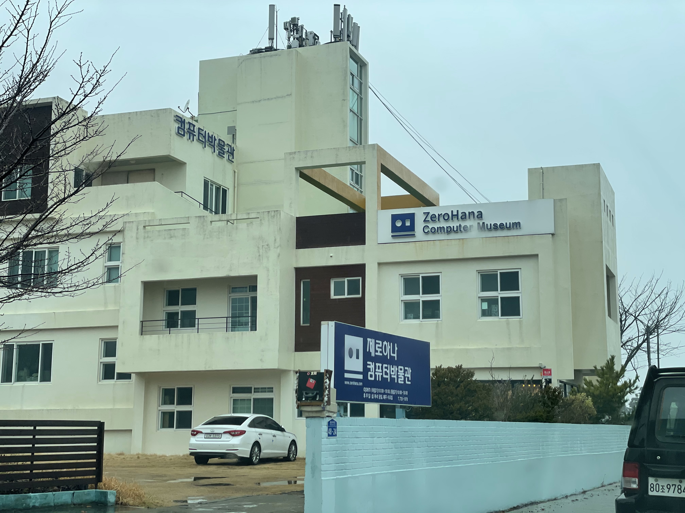
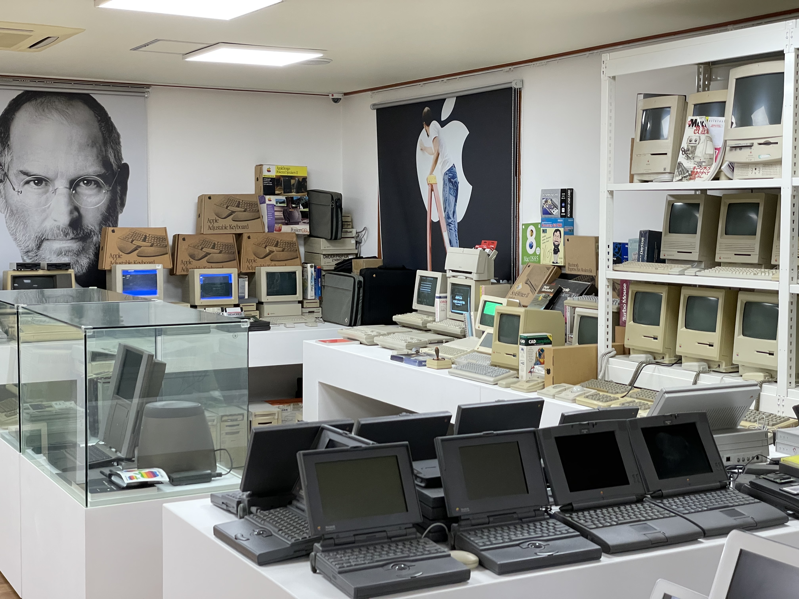
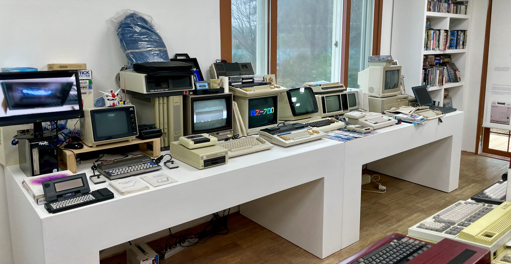
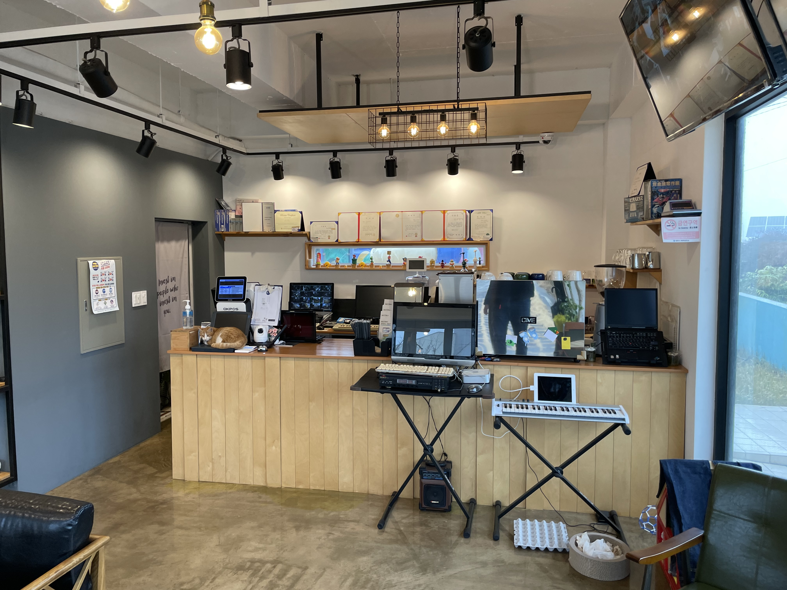
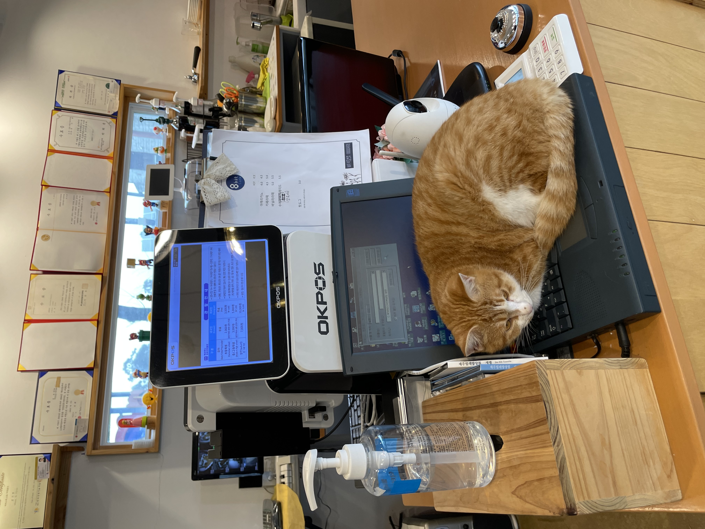
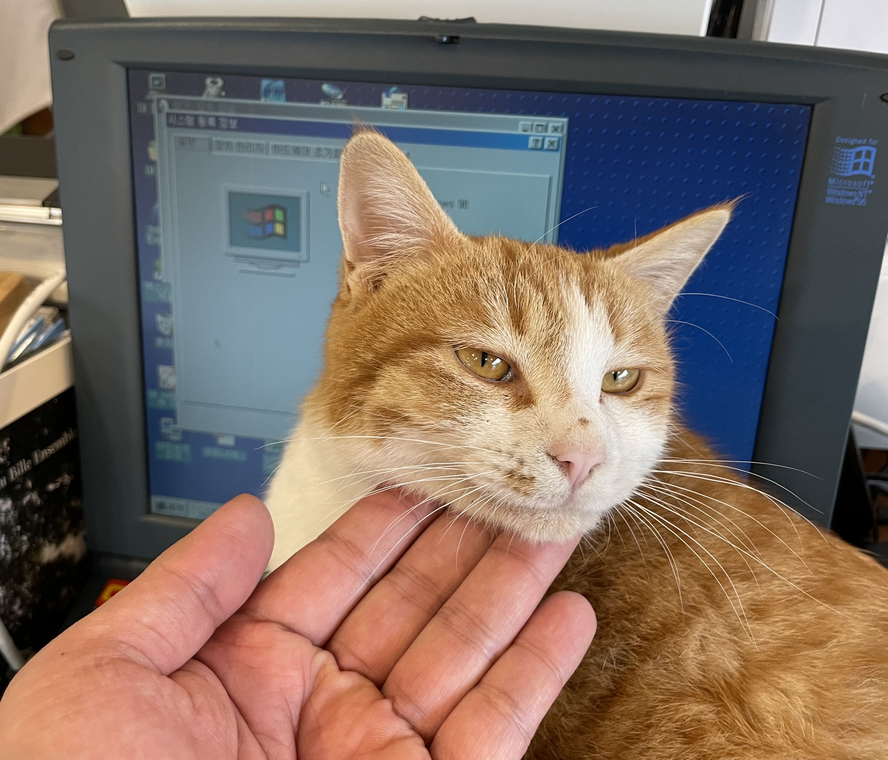
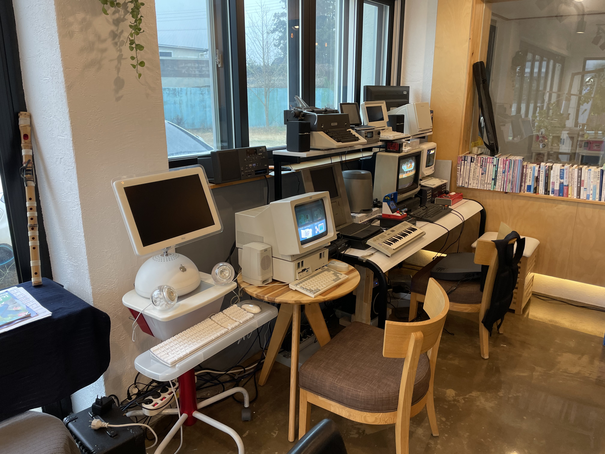

연초에 제주도를 다녀왔습니다. 당시 방문했던 장소들 중 기억에 남은 장소로 단연 **제로하나 컴퓨터 박물관**을 꼽을 수 있을 것 같습니다. 그래서 이곳에 대한 꼭 글을 쓰고 싶었습니다. 그러나 개인 사정으로 인해 장기간 블로그 업데이트를 하지 못했었고, 뒤늦게 거의 10개월이 지난 이 시점에서야 글을 씁니다. 

#### 제로하나 컴퓨터 박물관은

> 최초의 IBM PC인 IBM 5150 컴퓨터를 비롯하여 IQ1000, IQ2000, X-ii 등 MSX 컴퓨터 약 100여대와 많은 8 Bit 컴퓨터를 직접 체험하실 수 있으며 IBM 29 Card Punch 처럼 IT 역사에 중요한 제품을 실물로 보실 수 있습니다. (제로하나 컴퓨터 박물관 소개글 중)

제로하나 컴퓨터 박물관은, 컴퓨터의 역사에 조금이라도 관심을 가지고 있는 사람이라면 그 누구에게라도 권해 줄 수 있는, 속칭 **컴덕을 위한 박물관**이었습니다. 인터넷 커뮤니티의 방문 후기 글들을 우연히 접한 이래 꼭 가보고 싶다고 생각했던 곳이었고, 방문 후 10여개월이 지난 지금 시점에서라도 꼭 글을 쓰고 싶을 만큼 인상깊은 장소입니다. 박물관 내부 사진을 잠깐 보여드리자면...

애플 컴퓨터의 역사 그 자체도 있고...

실제로 매우 잘 작동하는 수많은 8비트 컴퓨터들도 만나볼 수 있습니다.

---

분명히 개인 박물관으로 알고 찾아왔는데, 도저히 개인으로써 이 많은 컴퓨터들을 수집했으리라고는 믿겨지지 않을 만큼 많은 전시물품들이 준비되어 있고, 가장 중요한 건 다른 박물관이랑 다르게 이 모든 전시물품을 직접 만져보고 사용해볼 수 있다는 점입니다. 대부분의 전시물품은 전부 전원을 켤 수 있고, 구동해볼 수 있고, 게임 등을 원하는대로 자유롭게 실행해볼 수도 있습니다.

### 1층 - 8bit 카페

1층에는 카페(이름이 무려 8비트 카페)가 마련되어 있고 이 곳에서 입장권 발매가 가능합니다. 입장권을 발매하면 관장님이 직접 나오셔서 전시물품들의 전원을 모두 켜고 세팅하고 올 테니 5분 정도만 기다려 달라고 하십니다. 전기세가 너무 많이 나오고 손님이 많지 않아 평소에는 전부 전원을 꺼두시는 것 같더라구요. ㅠㅠ

입구에서부터 심상치 않음을 느낄 수 있는데요. 포스기 앞에 고양이가 한 마리 앉아 있는데, 이 고양이가 깔고 앉은 노트북에서 심상치 않은 포스가 느껴집니다.

그리고 카페 내 손님들에게 레트로 게임들을 즐길 수 있도록 한켠에 준비된 코너도 있었습니다.

갑자기 호빵맥 등장... 잘 작동하는 구형 컴퓨터들을 이용해서 게임을 할 수 있도록 설치해 두었네요. 사진을 잘 보시면 저 사이에 **Apple 창립 20주년 기념 한정판 매킨토시**가 있는데, 원래 공식적으로는 **한국에 딱 한 대** 수입된 제품입니다. 일부 매니아들이 이베이 등을 통해 국내로 들여온게 극소수나마 몇 대 있는데 이곳 제로하나 컴퓨터 박물관에는 무려 3대가 전시되어 있습니다. 카페 매장 음악도 저 제품을 통해 재생하더라고요(...)

추가 작성 중

 글을 쓰기 위해 뒤늦게 정보를 찾아보던 중 이곳이 2021년 11월까지만 운영하고, 12월 1일부터는 **운영을 중단**한다는 소식을 접하게 되었습니다.

개인 박물관이고, 홍보가 덜 되어있고, 다소 마니아를 타겟으로 한 박물관인 만큼 제가 방문했을 때도 손님이 없긴 했습니다. 박물관 관장님도 전기세조차 내기 어려울 정도라고 말씀하시며 여러 차례 경영난을 호소하시던 상황이었던지라, 여러모로 운영상의 어려움에 의해 문을 닫게 된 것으로 보입니다. 박물관의 전시물품들은 다른 기관 혹은 지자체 등에 인계하길 희망하고 계시는 상황이라고 합니다.

