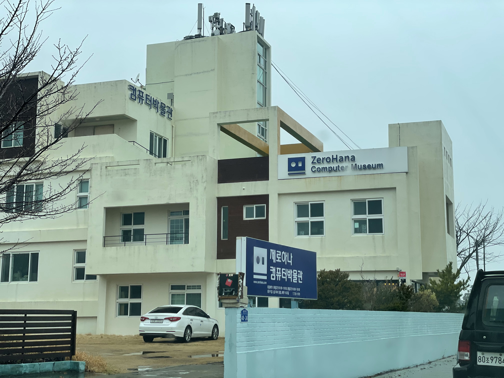

## 제로하나 컴퓨터 박물관

연초에 제주도를 다녀왔습니다. 당시 방문했던 장소들 중 기억에 남은 장소로 단연 **제로하나 컴퓨터 박물관**을 꼽을 수 있을 것 같았습니다. 그래서 이곳에 대한 꼭 글을 쓰고 싶었습니다. 그러나 개인 사정으로 인해 장기간 블로그 업데이트를 하지 못했었고, 뒤늦게 거의 10개월이 지난 이 시점에서야 글을 씁니다. 

제로하나 컴퓨터 박물관은 컴퓨터의 역사에 조금이라도 관심을 가지고 있는 사람이라면 그 누구에게라도 권해 줄 수 있는, 속칭 **컴덕을 위한 박물관**이었는데요. 지금 시점에서라도 꼭 글을 쓰고 싶을 만큼 인상깊은 장소였고, 이 장소가 덜 알려졌다는 사실 또한 아쉬워서 글을 쓰고자 했었는데...

이곳이 2021년 11월까지만 운영하고, 12월 1일부터는 **운영을 중단**한다는 소식을 접하게 되었습니다.

개인 박물관이고, 홍보가 덜 되어있고, 다소 마니아를 타겟으로 한 박물관인 만큼 제가 방문했을 때도 손님이 없었고 박물관 관장님도 전기세조차 내기 어려울 정도라고 말씀하시며 여러 차례 경영난을 호소하시던 상황이라 여러모로 운영상의 어려움에 의해 문을 닫게 된 것으로 보입니다. 박물관의 전시물품들은 다른 기관 혹은 지자체 등에 인계하길 희망하고 계시는 상황이라고 합니다.

> 최초의 IBM PC인 IBM 5150 컴퓨터를 비롯하여 IQ1000, IQ2000, X-ii 등 MSX 컴퓨터 약 100여대와 많은 8 Bit 컴퓨터를 직접 체험하실 수 있으며 IBM 29 Card Punch 처럼 IT 역사에 중요한 제품을 실물로 보실 수 있습니다.