이 글은 [제로하나 컴퓨터박물관 방문기 1편](/review/zerohana-museum/)에서 이어지는 글입니다. **아직 다 작성되지 않았습니다.**

2021년 초에 다녀온 제로하나 컴퓨터박물관의 방문 후기를 2022년 8월이 되어서야 마무리해가고 있습니다. 워낙 인상깊었던 곳이었기에 늦게라도 적어봅니다. 1편은 2021년 12월에 적었고, 2편은 2022년 8월에 적으니 글 하나를 완성하는데 무려 1년 7개월이 걸린 셈이네요. 시간이 참 많이 지났습니다. <Del>아이고 게을러라...</del>

## 3층

3층에는 두 개의 전시실이 있었는데요. 하나는 IBM PC의 살아있는 역사를 보여주는 전시실이었고, 다른 하나는 옛날 추억의 고전게임들과 PC 관련 서적을 모아볼 수 있게 해 둔 전시실이었습니다.

### IBM PC관

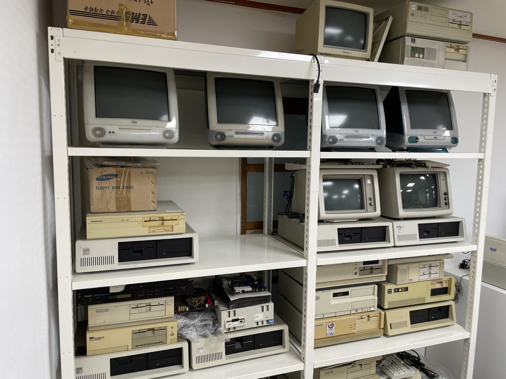

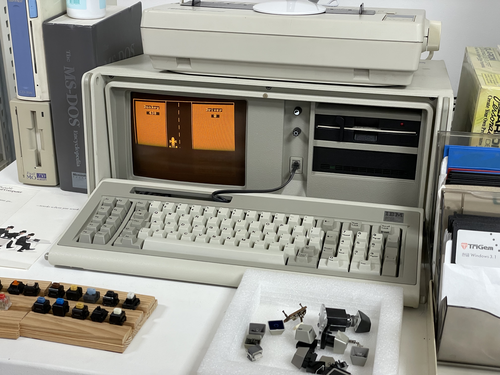

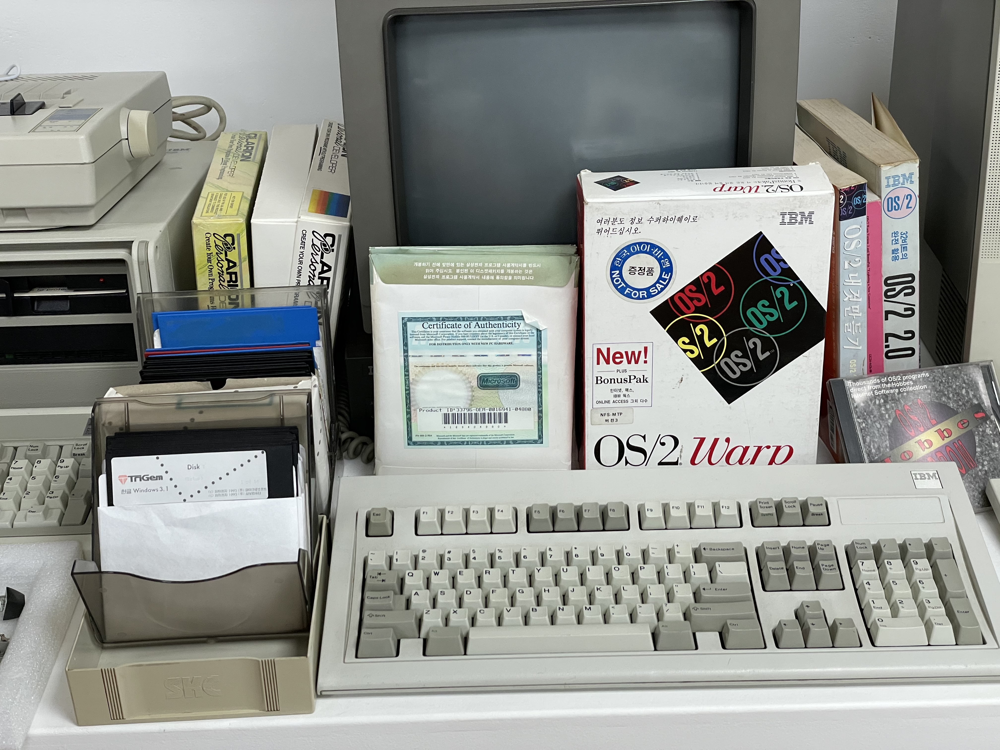

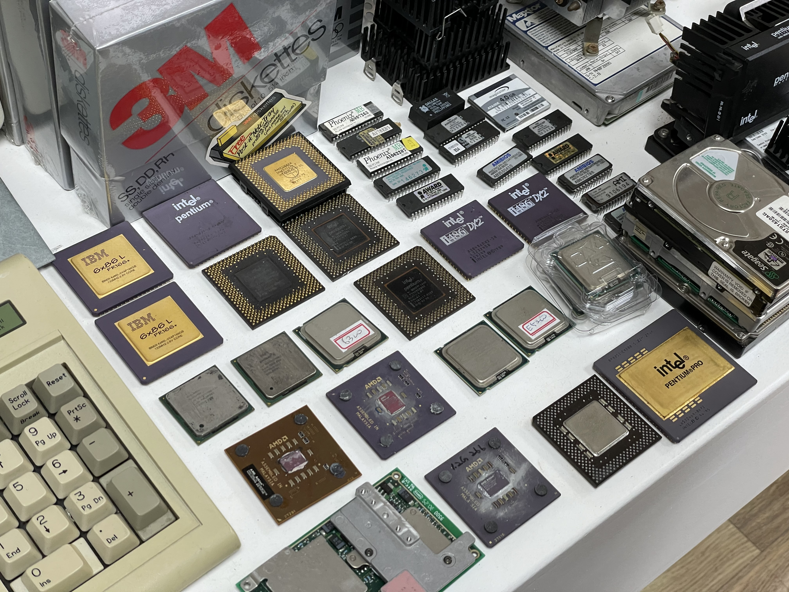

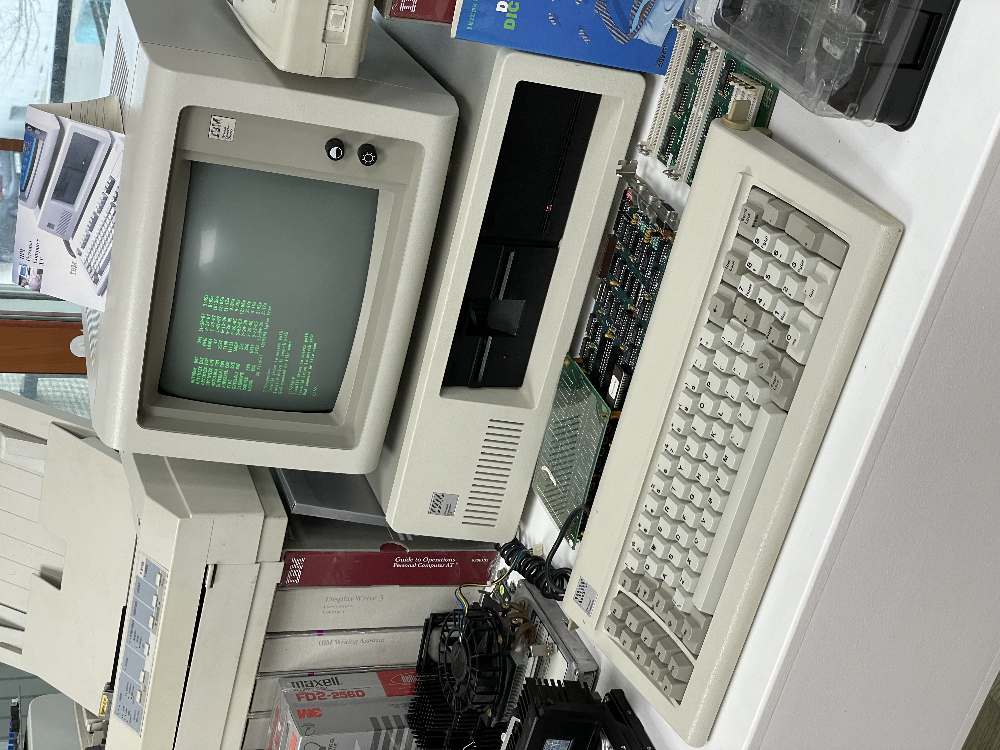

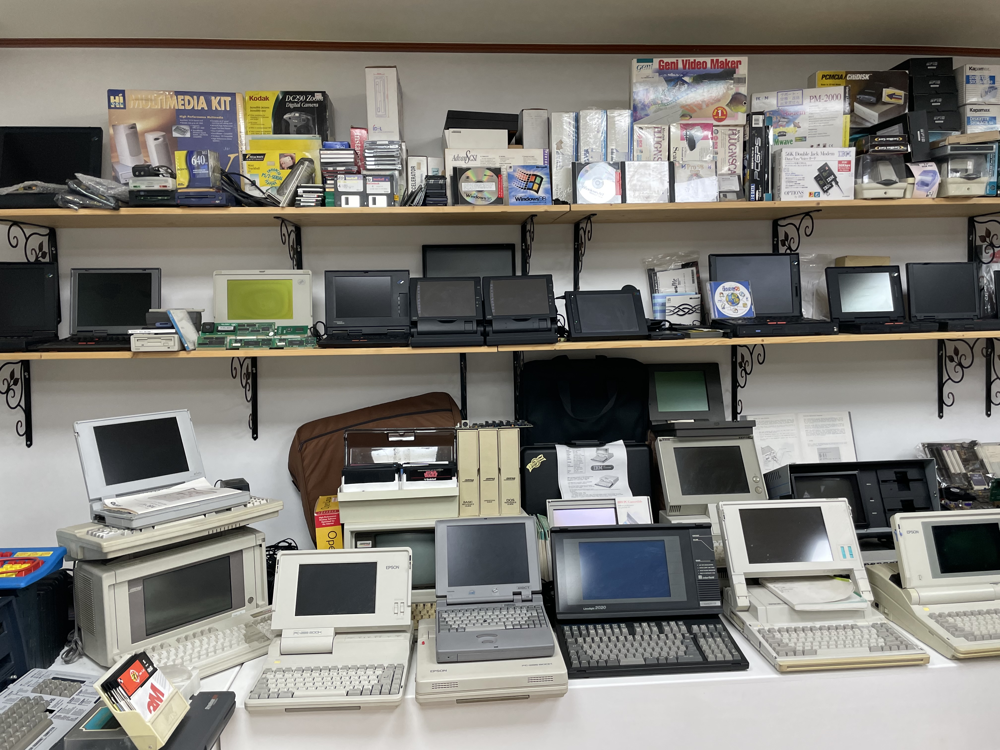

### 고전게임 및 잡지 관람관

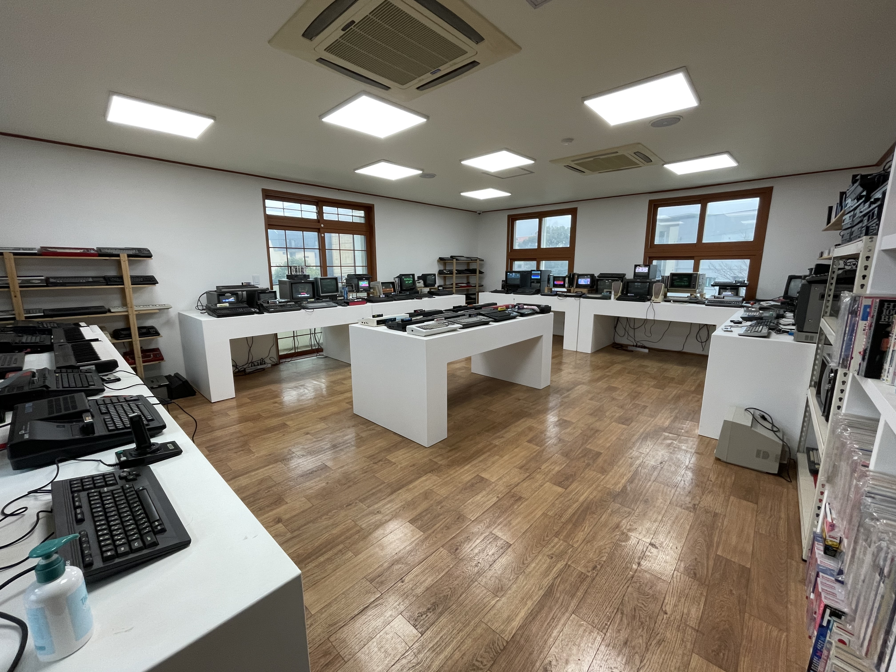

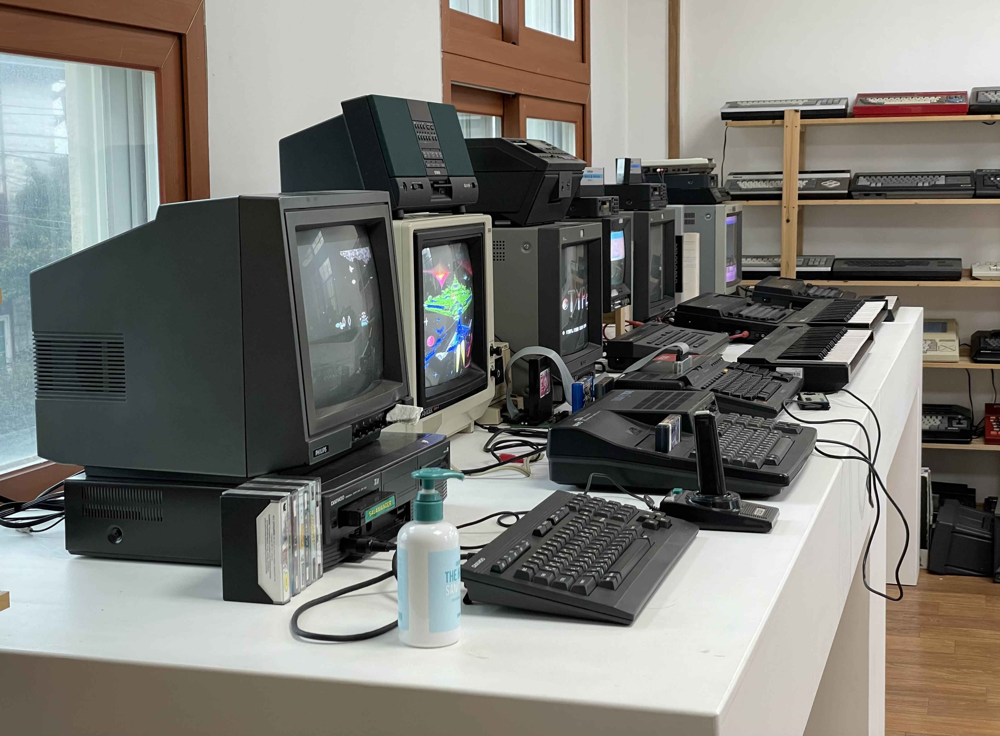

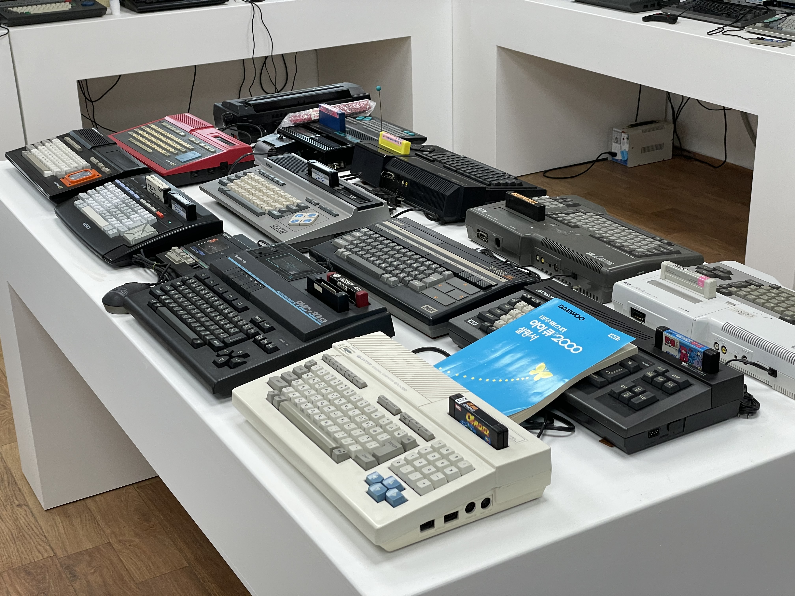

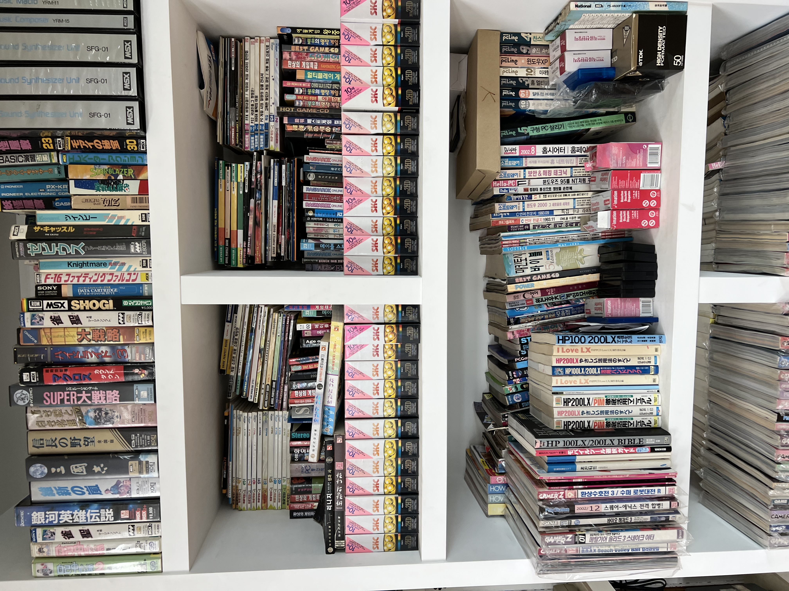

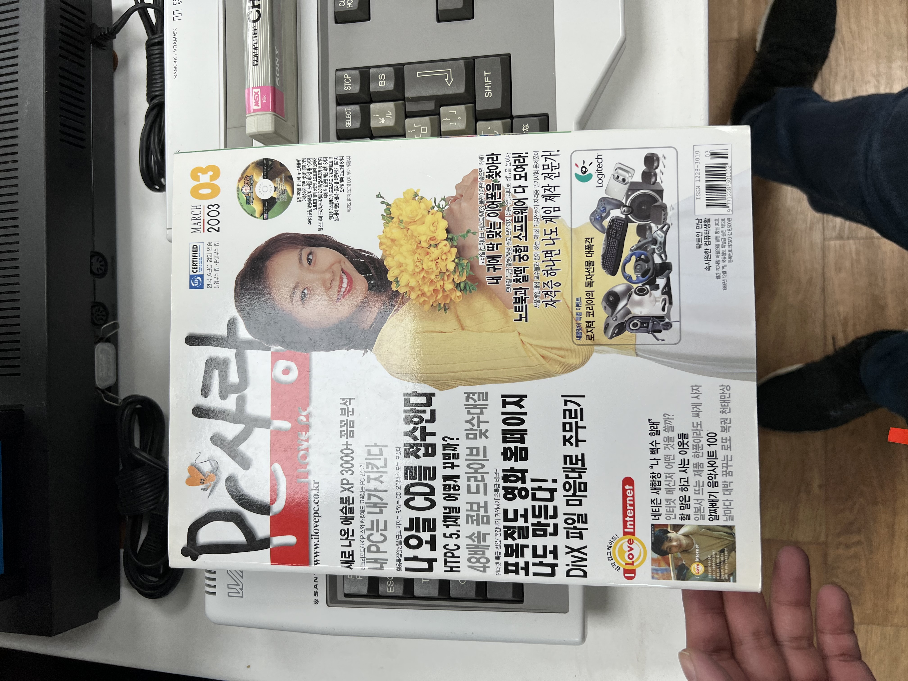

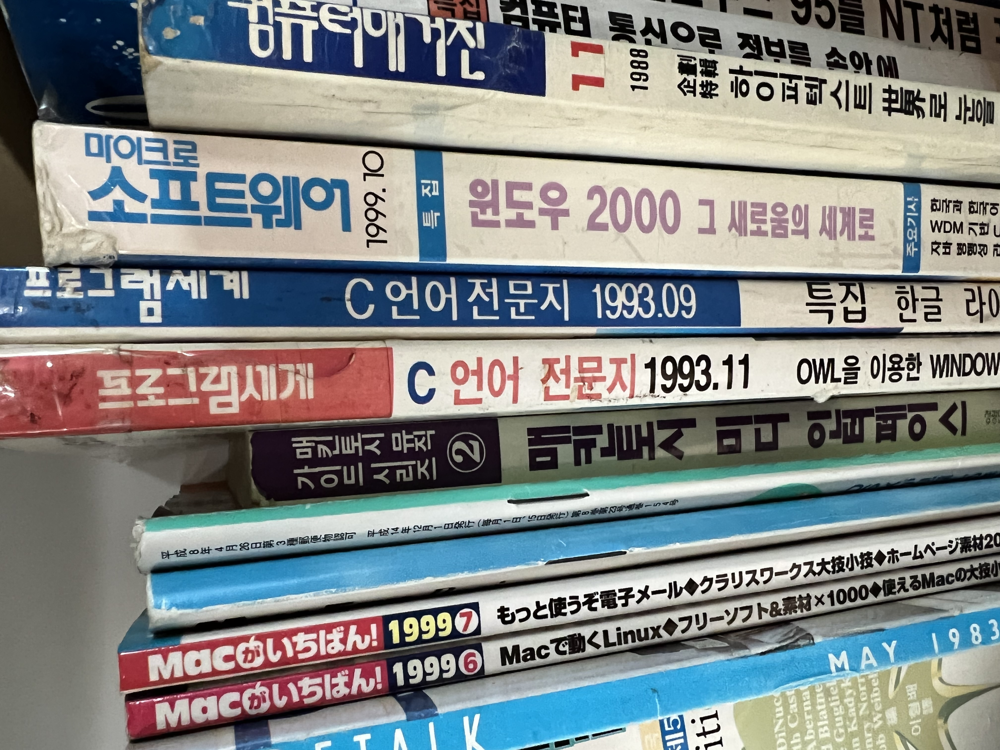

## 4층

### 애플 전문관

 

[아직 작성 중]

## 마무리하며

 글을 쓰기 위해 뒤늦게 정보를 찾아보던 중 이곳이 2021년 11월까지만 운영하고, 12월 1일부터는 **운영을 중단**한다는 소식을 접하게 되었습니다.

개인 박물관이고, 홍보가 덜 되어있고, 다소 마니아를 타겟으로 한 박물관인 만큼 제가 방문했을 때도 손님이 없긴 했습니다. 박물관 관장님도 전기세조차 내기 어려울 정도라고 말씀하시며 여러 차례 경영난을 호소하시던 상황이었던지라, 여러모로 운영상의 어려움에 의해 문을 닫게 된 것으로 보입니다. 박물관의 전시물품들은 다른 기관 혹은 지자체 등에 인계하길 희망하고 계시는 상황이라고 합니다.

**[현재 작성 중]**

